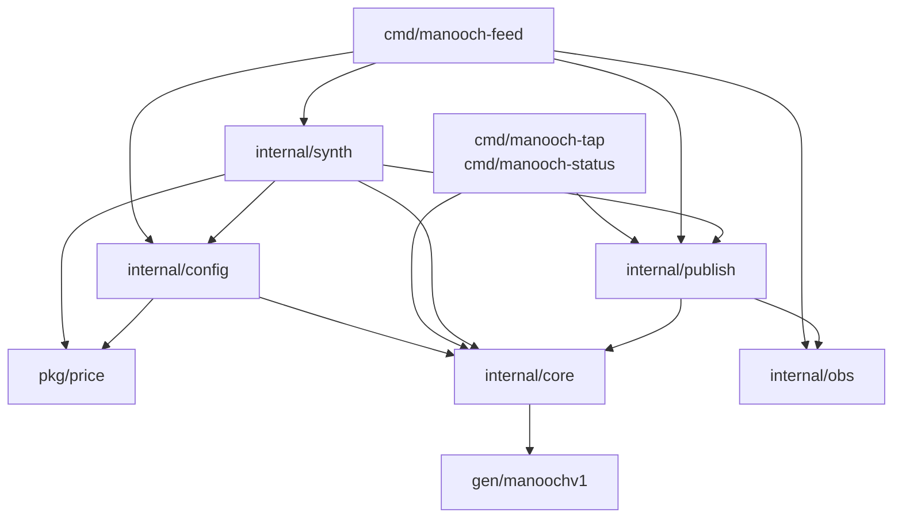
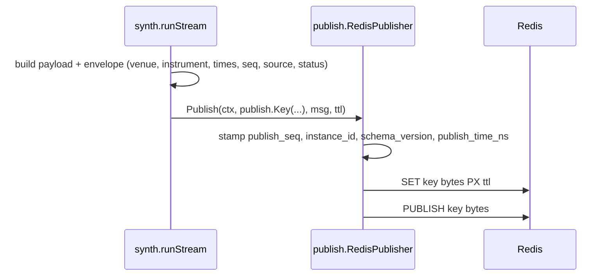

Covers: M0 · whole repository

A market-data price service: connect to one exchange over public websockets, normalize, publish to Redis. One process per venue, selected by `--exchange`. At M0 there is no adapter — the only producer is `internal/synth`.

## Shape

| Pattern | Where | Status |
|---|---|---|
| Outbound port | `publish.Publisher`; `RedisPublisher` is the only implementation | built |
| Inbound port | no `Adapter` interface exists; `internal/adapter/` is empty | M1 |
| Stateless pipeline | producer → envelope → marshal → Redis write; nothing stored in between | built |
| Shared-nothing by venue | one process, one venue file, nothing shared across venues | built |
| Supervision tree | goroutines started directly, joined on a `sync.WaitGroup` | M2 |

Not Clean/Onion (no domain model to protect), not event sourcing (current value, not a log), not layered.

## Dependency rule

`internal/core` imports nothing local except `gen/manoochv1`. A Redis client or venue package there would become an import cycle the moment an adapter names an instrument.



`gen/manoochv1` is imported by most packages; only `core`'s edge is drawn.

## One message



An M1 adapter replaces `synth`; everything from `Publish` rightward is unchanged.

## Redis layout

```
Manooch:{VENUE}:{MARKET_TYPE}:{SYMBOL}:{channel}
Manooch:{VENUE}:venue:{subject}
```

One pipelined round trip per message: `SET key bytes PX ttl_ms` then `PUBLISH key bytes`. The same string is key and channel; Redis keeps those namespaces separate.

The `SET` makes freshness a property of the data — key present means fresh, key absent means stale — with no second timestamp to drift. `ttl == 0` means no expiry, used for trades where a quiet minute is normal.

## Decisions

| Decision | Choice | Why |
|---|---|---|
| Topology | One process per venue | A venue's reconnect storm or ban cannot touch another venue. |
| Transport | Pub/Sub + last-value keys, not Streams | Consumers need current price, not history. |
| Wire format | protobuf, `gen/` committed | Field numbers make additive change safe; consumers never need `protoc`. |
| Numerics | `int64` fixed-point, never `float64` | 53 mantissa bits cannot hold `68432.15` and `0.00000000012` exactly. |
| Freshness | Redis key TTL | One mechanism carries data and liveness, so they cannot disagree. |
| Eviction | `noeviction` | Any eviction policy silently deletes the keys that mean "alive". |
| Drop detection | `publish_seq` + `instance_id` | Pub/Sub is fire-and-forget; a seq gap is the only evidence, and `instance_id` separates it from a restart. |
| Frameworks | None | `net/http.ServeMux` and `flag` suffice. |
| Config reload | Restart only | Behaviour that changes under a running process cannot be reconstructed. |

## Milestone map

| Path | State |
|---|---|
| `pkg/price`, `internal/{core,config,publish,obs,synth}`, `cmd/*` | built |
| `internal/adapter/` | empty — venue packages, M1 |
| `internal/transport/` | empty — websocket connections, M1/M2 |
| `internal/fallback/` | empty — REST polling on expired-key events, M2 |
| `internal/metadata/` | empty — instrument metadata refresh, M3 |
| `testdata/` | empty — venue fixtures, M1 |

Config sections `fallback`, `supervisor`, `metadata`, `rate_limit`, `connection` and `endpoints` parse and validate today but nothing reads them.
