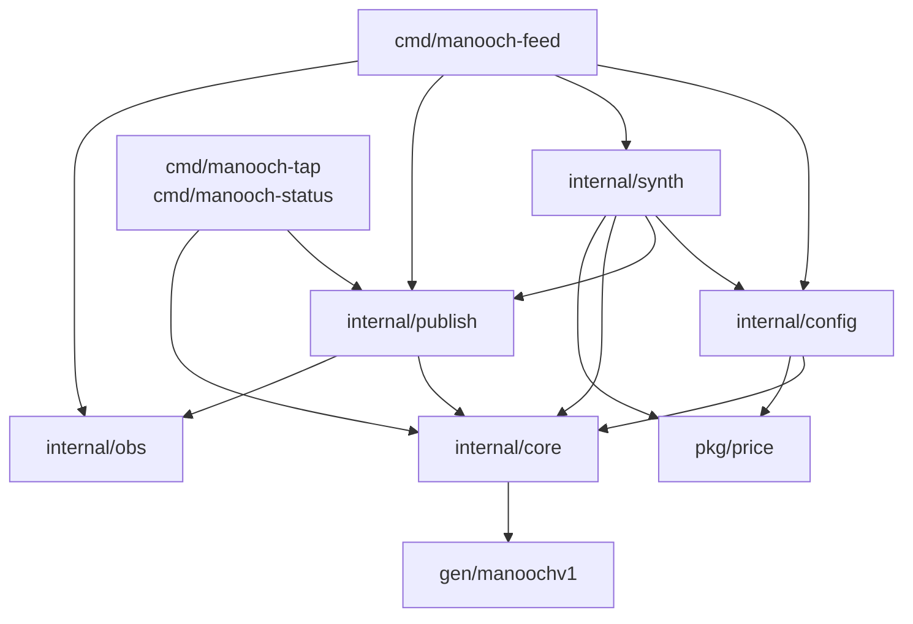
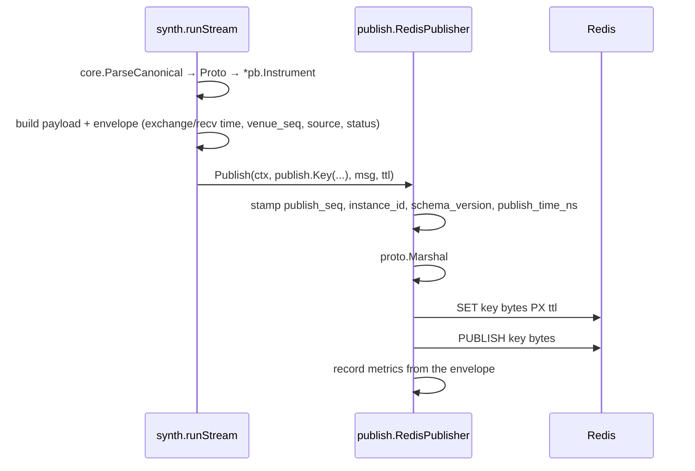

Covers: M0 · whole repository

Manooch is a market-data price service: it connects to crypto exchanges over public websockets, normalizes what it sees into one internal format, and publishes to Redis for downstream consumers. One OS process serves one venue, selected by `--exchange`. At M0 no exchange adapter exists — the only producer is `internal/synth`, which generates data so the publish path can be exercised end to end.

## The shape

| Pattern | Where | Status |
|---|---|---|
| Ports and adapters, outbound | `publish.Publisher` interface; `publish.RedisPublisher` is the only implementation | built |
| Ports and adapters, inbound | no `Adapter` interface exists; `internal/adapter/` is an empty directory | M1 |
| Stateless dataflow pipeline | `synth.build` → `core.InstrumentRef.Proto` → envelope → `proto.Marshal` → Redis write | built |
| Shared-nothing partition by venue | `--exchange` picks one venue file; nothing in the process is shared across venues | built |
| Supervision tree | none. `cmd/manooch-feed` starts goroutines directly and waits on a `sync.WaitGroup` | M2 |

Producers depend on `publish.Publisher`, not on Redis. `internal/synth` takes a `publish.Publisher` in `synth.New`, so a venue adapter in M1 substitutes for `synth` without the publisher changing.

### What it is not

- **Not Clean or Onion.** There is no domain model to protect. `core.InstrumentRef` is an identity struct with three methods; the "business logic" is parsing, range checking and key construction. A layer of interfaces around that would be indirection with nothing behind it.
- **Not event sourcing.** Redis holds the current value per key, not a log. History is the consumer's problem.
- **Not layered.** `internal/config` imports `internal/core` and `pkg/price` directly; there is no service or repository tier between them.

## Dependency rule

`internal/core` imports no venue package and no Redis client. It imports only `gen/manoochv1` and the standard library. A violation looks like `import "github.com/redis/go-redis/v9"` appearing in `internal/core`, or `internal/core` importing `internal/adapter/...` in M1 — either makes the identity types unusable from a consumer that does not have Redis, and creates an import cycle the moment an adapter needs to name an instrument.



`gen/manoochv1` is imported by most packages here; only `internal/core`'s edge is drawn, to keep the graph readable. `pkg/price` and `gen/manoochv1` import nothing from this repository. `pkg/price` sits under `pkg/` because consumers import it to decode published values.

## Dataflow for one message



In M1 a venue adapter replaces `synth.runStream` as the producer. Everything from `Publish` rightward is unchanged: the adapter fills the same envelope fields and calls the same interface.

## Redis layout

```
Manooch:{VENUE}:{MARKET_TYPE}:{SYMBOL}:{channel}     e.g. Manooch:BINANCE:SPOT:BTC_USDT:orderbook
Manooch:{VENUE}:venue:{subject}                      e.g. Manooch:BINANCE:venue:health
```

Each publish is one pipelined round trip: `SET key bytes PX ttl_ms` then `PUBLISH key bytes`. The same string is both the key and the Pub/Sub channel — Redis keeps those in separate namespaces.

The `SET` makes a cold consumer's first read return current state instead of waiting for the next tick, and makes freshness a property of the data: key present means fresh, key absent means stale. There is no separate timestamp that can disagree with the data next to it. `ttl == 0` writes a key with no expiry; `internal/synth` uses that for trades, where a quiet minute is normal and an expiring key would report a working stream as dead.

## Decisions

| Decision | Choice | Why |
|---|---|---|
| Process topology | One process per venue | A venue's reconnect storm or rate-limit ban cannot touch another venue's streams. |
| Transport | Redis Pub/Sub + last-value keys, not Streams | A consumer needs current price, not history; Streams add consumer-group state to manage for data that is obsolete in 100ms. |
| Wire format | protobuf, generated code committed | Field numbers make additive change safe; committing `gen/` means consumers never need `protoc`. |
| Numerics | `int64` at fixed scales, never `float64` | `float64` has 53 bits of mantissa and cannot hold both `68432.15` and `0.00000000012` exactly. |
| Freshness | Redis key TTL | One mechanism carries both the data and its liveness, so they cannot drift apart. |
| Eviction | `maxmemory-policy noeviction` | Any eviction policy silently deletes the keys that say a stream is alive; `noeviction` turns memory pressure into a write error we can report. |
| Drop detection | `publish_seq` per key + `instance_id` per process | Pub/Sub is fire-and-forget; a gap in `publish_seq` is the only evidence a subscriber missed messages, and `instance_id` separates that from a restart. |
| Frameworks | None — stdlib plus seven direct dependencies | `net/http.ServeMux` and `flag` cover what is needed; a framework would add a config surface and an upgrade treadmill for no capability. |
| Config reload | Restart only, no watcher, no SIGHUP | Behaviour that changes under a running process cannot be reconstructed after the fact. |

## Milestone map

| Path | State |
|---|---|
| `pkg/price`, `internal/core`, `internal/config`, `internal/publish`, `internal/obs`, `internal/synth`, `cmd/*` | built at M0 |
| `internal/adapter/` | empty — venue packages (websocket parsing, normalization) in M1 |
| `internal/transport/` | empty — websocket connection handling, M1/M2 |
| `internal/fallback/` | empty — REST polling driven by expired-key events, M2 |
| `internal/metadata/` | empty — instrument metadata refresh, M3 |
| `testdata/` | empty — venue message fixtures, M1 |

Config sections `fallback`, `supervisor`, `metadata`, `rate_limit`, `connection` and `endpoints` are parsed and validated today but read by nothing; they exist so the phases above have somewhere to land. See `docs/config.md`.
