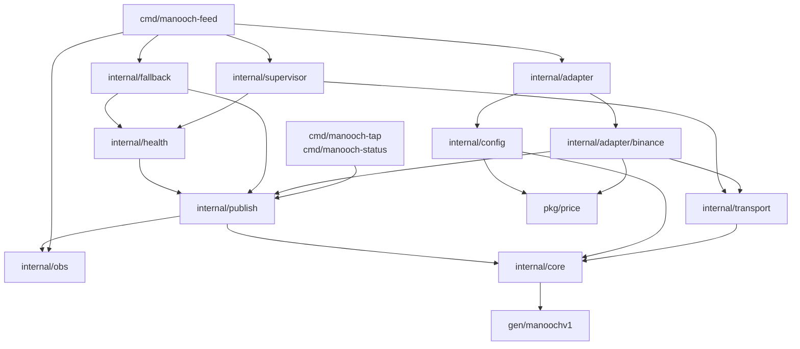
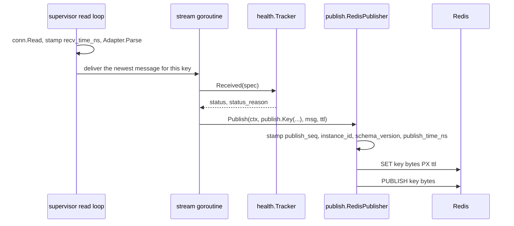

Covers: M2 · whole repository

A market-data price service: connect to one exchange over public websockets, normalize, publish to Redis. One process per venue, selected by `--exchange`.

**Scope, permanently:** perpetual linear mark price, index price and funding. Order books and trades were dropped at M1.

## Shape

| Pattern | Where | Status |
|---|---|---|
| Outbound port | `publish.Publisher`; `RedisPublisher` is the only implementation | built |
| Inbound port | `core.Adapter`; `internal/adapter/binance` is the only implementation | built |
| Stateless pipeline | producer → envelope → marshal → Redis write; nothing stored in between | built |
| Shared-nothing by venue | one process, one venue file, nothing shared across venues | built |
| Supervision tree | `internal/supervisor`; stream-level recovery, no process exit | built |

Not Clean/Onion (no domain model to protect), not event sourcing (current value, not a log), not layered.

## Supervision tree

```
process (one per venue)
├── health heartbeat        internal/health — ticker, transitions, the health keys
├── fallback watcher        internal/fallback — expiry subscriber + EXISTS sweep
├── http server             cmd/manooch-feed — loopback only
└── socket supervisor       internal/supervisor — one per core.SocketPlan
    ├── read loop           its own goroutine: it is what parks in conn.Read
    └── stream goroutine    one per (market_type, symbol, channel)
```

Nothing in it exits the process. One stream failing restarts that stream; a read
error or enough of a socket's keys expiring together redials that socket; a
goroutine that will not return is counted, logged and abandoned. The trade is
deliberate — no restart loops, and therefore no reconnect storms, at the cost of
a leak an operator eventually has to notice. `supervisor.md`, `health.md` and
`fallback.md` carry the detail.

## Dependency rule

`internal/core` imports nothing local except `gen/manoochv1`. A Redis client or venue package there would become an import cycle the moment an adapter names an instrument.



`supervisor` and `fallback` never import each other: they are joined in
`cmd/manooch-feed` by two function fields, `OnExpired` and `OnMessage`. Neither
imports `config` either — both are handed resolved values, the way an adapter
is.

`gen/manoochv1` is imported by most packages; only `core`'s edge is drawn. `core` still imports nothing local but `gen/manoochv1`, `core.Adapter` included — which is why `Message.Key` is a plain string an adapter fills with `publish.Key`.

## One message



The REST fallback enters at the same `Publish` with `SOURCE_REST`, and the
metadata refresher enters there with its own envelope. Everything from `Publish`
rightward is identical for all three.

## Redis layout

```
Manooch:{VENUE}:{MARKET_TYPE}:{SYMBOL}:{channel}
Manooch:{VENUE}:venue:{subject}
```

One pipelined round trip per message: `SET key bytes PX ttl_ms` then `PUBLISH key bytes`. The same string is key and channel; Redis keeps those namespaces separate.

The `SET` makes freshness a property of the data — key present means fresh, key absent means stale — with no second timestamp to drift. A key's TTL is its channel's `quirks.cadence` times `health.ttl_multiplier`.

## Decisions

| Decision | Choice | Why |
|---|---|---|
| Topology | One process per venue | A venue's reconnect storm or ban cannot touch another venue. |
| Transport | Pub/Sub + last-value keys, not Streams | Consumers need current price, not history. |
| Wire format | protobuf, `gen/` committed | Field numbers make additive change safe; consumers never need `protoc`. |
| Numerics | `int64` fixed-point, never `float64` | 53 mantissa bits cannot hold `68432.15` and `0.00000000012` exactly. |
| Freshness | Redis key TTL | One mechanism carries data and liveness, so they cannot disagree. |
| Eviction | `noeviction` | Any eviction policy silently deletes the keys that mean "alive". |
| Drop detection | `publish_seq` + `instance_id` | Pub/Sub is fire-and-forget; a seq gap is the only evidence, and `instance_id` separates it from a restart. |
| Frameworks | None | `net/http.ServeMux` and `flag` suffice. |
| Config reload | Restart only | Behaviour that changes under a running process cannot be reconstructed. |
| Scope | Perp mark price only; books and trades deleted | Two of four channels carried all the depth and sequencing complexity and none of the value this service exists for. |
| Venue boundary | One `core.Adapter` per venue, holding no stream state | Supervision can change without touching a venue package; state in the adapter would make that a rewrite. |
| Parse purity | `Parse` is a pure function of `(frame, recvNs)` | Fixture replay tests nothing otherwise, and a message that differs between identical frames cannot be reasoned about. |
| Cadence | Per channel, in the venue file | KuCoin funding is 60s against 1s mark price; one number would expire the slower key between updates. |
| Missing data | Skip the message, never substitute a zero | Zero is a real funding rate; an empty one published as zero is a number a strategy trades on. |
| Failure mode | Supervise; the process never exits on a stream or socket failure | A restart drops every other stream on the venue to fix one, and loses the state that says which. |
| Recovery unit | The stream goroutine, then the socket | The smallest thing that can be wrong on its own, so recovering it disturbs nothing else. |
| Leaked goroutines | Counted and held at `DEGRADED`, never self-killed | Go cannot kill a goroutine; with no self-kill the only alternative to visibility is silence. |
| Backoff | Exponential with full jitter | Deterministic backoff makes concurrent failures retry in lockstep, which is the reconnect storm most IP bans come from. |
| Circuit breaker | Stop attempting entirely after 10 consecutive failures | Backoff alone still knocks every minute forever on a venue that is refusing us. |
| Reconnect timing | Proactive at `connection.max_age` | A planned redial is a handover; an unplanned one is a gap nobody chose the moment of. |
| Fallback trigger | The expired key itself, plus an `EXISTS` sweep | A second staleness clock beside the TTL is a second answer that eventually disagrees. |
| Fallback labelling | Same channel and key, `SOURCE_REST` + `STATUS_DEGRADED` | Consumers keep one code path, and the difference is visible to anyone who checks. |
| Health heartbeat | Republish every interval regardless of change | Pub/Sub is fire-and-forget, so silence must never mean both "quiet" and "dead". |

## Milestone map

| Path | State |
|---|---|
| `pkg/price`, `internal/{core,config,publish,obs}`, `cmd/*` | built |
| `internal/adapter/` | built — `binance`, plus the shared conformance suite |
| `internal/transport/` | built — one websocket connection, backoff, circuit breaker |
| `internal/supervisor/` | built — the restart procedure and both escalation tiers |
| `internal/health/` | built — status computation, transition and heartbeat publishing |
| `internal/fallback/` | built — expiry watcher, sweep backstop, REST poller |
| `internal/core/coretest/` | built — the `core.Conn` and `core.Adapter` fault-injection doubles |
| `testdata/binance/` | built — one raw frame per case, beside its golden |
| `internal/metadata/` | empty — instrument metadata refresh, M3 |

Config sections `metadata` and `rate_limit` parse and validate but nothing reads them. `FetchMetadata` returns `core.ErrNotImplemented`.

Not built, and deliberately not designed for: the rate limiter, metadata refresh, venue-level rollup status, adaptive staleness thresholds, a second venue.
